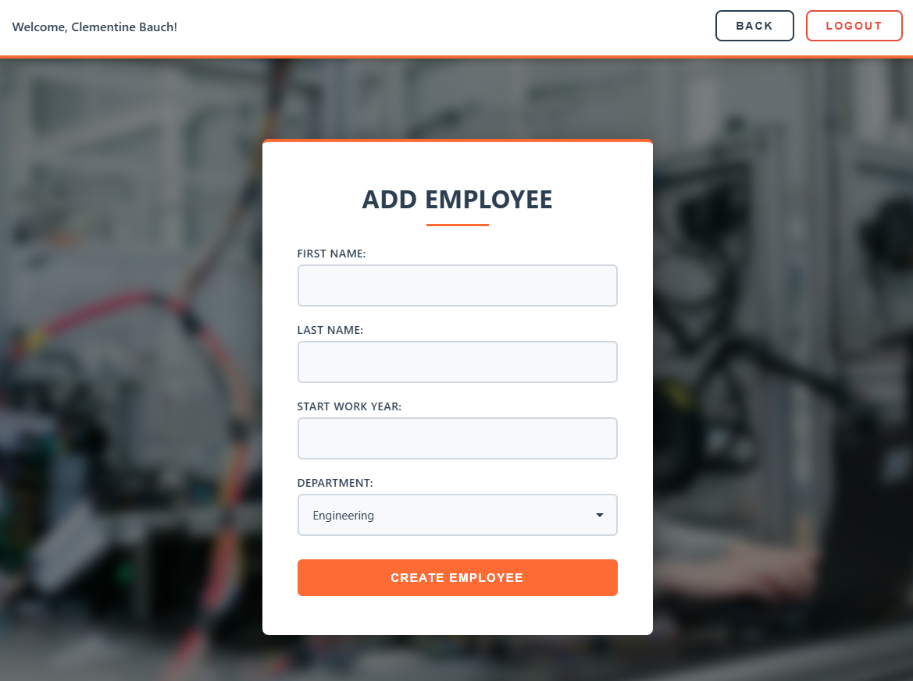

# Factory Management System

Full-stack application for managing employees, departments, and shifts, 
including daily activity limits and optional AI-powered shift schedule generation.

## Overview
The production management system is a full-featured CRUD + AI project that simulates a real factory management system:
workers, departments, and shifts. The project includes authentication, action restrictions, a well-thought-out layer architecture, 
and integration with OpenAI for scheduling.

## Tech Stack
Backend:
- Node.js + Express
- MongoDB + Mongoose
- Layered Architecture (Controllers → Services → Repositories → Models)
- JWT + middleware-based authorization
- JSONPlaceholder API (login)

Frontend:
- Vanilla JavaScript
- HTML + CSS
- Responsive UI

## 🌐 Live Demo

**Backend (Render):**  
https://factory-backend-2.onrender.com

**Frontend (Netlify):**  
https://splendorous-bavarois-ac9705.netlify.app/

> ⚠️ Note: The backend is hosted on Render free tier.  
> The first request after inactivity may take ~30–60 seconds to wake up.

### 🔐 Test Login

Use the following user or another from *https://jsonplaceholder.typicode.com/users* (external API for login):

- Username: `Bret`  
- Email: `Sincere@april.biz`


## Backend Architecture Overview
```txt
backend/
│── app.js                     # Main Express application
│── package.json
│── package-lock.json
│── .env
│
├── config/
│   └── db.js                  # MongoDB connection setup
│
├── controllers/               # Handles request/response logic
│   ├── loginController.js
│   ├── employeesController.js
│   ├── departmentsController.js
│   ├── shiftsController.js
│   ├── usersController.js
│   └── useAIController.js
│
├── services/                  # Business logic layer
│   ├── loginService.js
│   ├── employeesService.js
│   ├── departmentsService.js
│   ├── shiftsService.js
│   ├── usersService.js
│   └── actionsService.js
│
├── repositories/              # Database access layer (Mongoose queries)
│   ├── employeesRepo.js
│   ├── departmentsRepo.js
│   ├── shiftsRepo.js
│   ├── usersRepo.js
│
├── models/                    # Mongoose models
│   ├── employeeModel.js
│   ├── departmentModel.js
│   ├── shiftModel.js
│   └── userModel.js
│
├── routers/                   # Express route definitions
│   ├── loginRouter.js
│   ├── employeesRouter.js
│   ├── departmentsRouter.js
│   ├── shiftsRouter.js
│   ├── usersRouter.js
│   └── useAIRouter.js
│
├── middlewares/
│   └── checkUserActions.js    # JWT validator + daily request limiter
│
└── data/
    ├── actions.json           # Daily logs of user actions
    └── weekly_schedule.xlsx   # Auto-generated Excel from AI
```

## Frontend Architecture Overview
```txt
├───index.html
│
├───login
│       
│       login.css
│       login.js
│
├───pages
│   ├───addDepartment
│   │       addDepartment.css
│   │       addDepartment.html
│   │       addDepartment.js
│   │
│   ├───addEmployee
│   │       addEmployee.css
│   │       addEmployee.html
│   │       addEmployee.js
│   │
│   ├───departments
│   │       departments.css
│   │       departments.html
│   │       departments.js
│   │
│   ├───editDepartment
│   │       editDepartment.css
│   │       editDepartment.html
│   │       editDepartment.js
│   │
│   ├───editEmployee
│   │       editEmployee.css
│   │       editEmployee.html
│   │       editEmployee.js
│   │
│   ├───employees
│   │       employees.css
│   │       employees.html
│   │       employees.js
│   │
│   ├───shifts
│   │       shifts.css
│   │       shifts.html
│   │       shifts.js
│   │
│   └───users
│           users.css
│           users.html
│           users.js
│
└───shared
        ai-button.js
        styles.css
        utils.js
```

## How to Run Locally
1. Install backend dependencies:
- npm install

2. Create .env file:
- MONGODB_URI=your-mongodb-uri
- JWT_SECRET=your-jwt-secret
- OPENAI_API_KEY=your-openai-api-key # optional (for AI scheduling)

3. Start backend:
- npm start
- By default the server runs on http://localhost:3000.

4. Open frontend:
- frontend/login/index.html


## Features
Authentication Flow:
- Login uses username + email - JSONPlaceholder API (https://jsonplaceholder.typicode.com/users).
- Users are auto-created in MongoDB and issued a JWT token.

Daily Actions Limit:
- Each user has 10 actions/day.
- GET does not count.
- POST/PUT/DELETE reduce the counter.
- Resets daily.

Main Features:
- Employees: view, filter by department, add employee, edit employee, assign shifts.
- Departments: add department, edit manager, view employees.
- Shifts: create shift, assign employee to shift, visualize with badges.
- AI Schedule Generator. AI button for future week schedule generation.


## REST API Documentation:
**Authentication**

| Method | Endpoint | Description |
|--------|----------|-------------|
| POST   | `/login` | Login using username + email (JSONPlaceholder). Creates user in DB if not exists. Returns JWT. |

**Users**

| Method |   Endpoint   |                 Description                 |             
|--------|--------------|---------------------------------------------|
|  GET   |  `/users`    | Get all system users                        |
|  GET   | `/users/:id` | Get user by ID                              |
|  POST  | `/users`     | Create user (internal use by login service) |

**Employees**

| Method |     Endpoint     |     Description       |
|--------|------------------|-----------------------|
|  GET   | `/employees`     | Get all employees     |
|  GET   | `/employees/:id` | Get employee by ID    |
|  POST  | `/employees`     | Create a new employee |
|  PUT   | `/employees/:id` | Update employee       |
| DELETE | `/employees/:id` | Delete employee       |

**Departments**

| Method |      Endpoint      |     Description      |
|--------|--------------------|----------------------|
|  GET   | `/departments`     | Get all departments  |
|  GET   | `/departments/:id` | Get department by ID |
|  POST  | `/departments`     | Create a department  |
|  PUT   | `/departments/:id` | Update department    |
| DELETE | `/departments/:id` | Delete department    |

**Shifts**
| Method |   Endpoint    |     Description          |
|--------|---------------|--------------------------|
|  GET   | `/shifts`     | Get all shifts           |
|  POST  | `/shifts`     | Create shift             |
|  PUT   | `/shifts/:id` | Assign employee to shift |

**AI Schedule Generator**
| Method | Endpoint | Description |
|--------|----------|-------------|
| POST | `/useAI/generateSchedule` | Generates weekly schedule using OpenAI API |

## Screenshots

### Login Page


### Employees Page




### Department Page


### Shifts Page


### Users Page


### AI Schedule Generator


### AI Schedule Generator (OpenAI):
This project includes an AI feature that automatically generates a weekly shift schedule
for all employees based on their departments and availability.

The feature uses the OpenAI API.
- Uses OpenAI API to generate weekly schedule.
- Requires OPENAI_API_KEY in .env.

### How it works
- The frontend has an **AI Schedule** button.
- When clicked, the client sends a request to `/useAI/generateSchedule`.
- The backend:
  - collects employee + shift data
  - sends a structured prompt to OpenAI
  - receives a generated weekly plan
  - returns the result to the frontend
- The result is formatted and can be downloaded as an Excel file.

To use the AI feature, the user must provide:
- OPENAI_API_KEY=your-openai-api-key
- Add this to your `.env` file.
- Without this key, the AI feature will be disabled (other functionality works normally).
